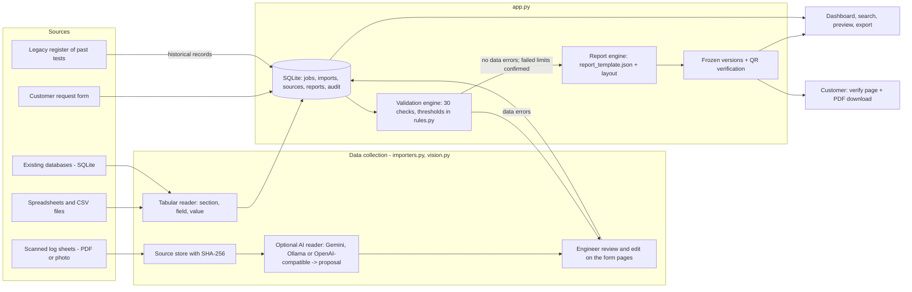

# Aletheia architecture

The same diagram, drawn in more detail, is on the app's **Architecture** page.

Data flow: every source ends up as the same per-section structure in the `jobs` table. Any change to that data resets
the job to "Data imported", so validation and the report are always derived from what is stored. Reports are built once
per version and stored with their hash; the verification page recomputes the hash on request.

## Modules

| Module | Responsibility |
|---|---|
| `importers.py` | Detect file type, read CSV / Excel / SQLite / JSON, convert between table rows and nested data, read legacy registers (including result and test date), export templates |
| `vision.py` | Read one source document with the configured vision model on request (page clean-up, part-by-part reading, enforced answer shape), enforce the daily limit for hosted models, cache readings, return a proposal only |
| `rules.py` | Engineering thresholds, each with its source and status; wording rules for observations ("No disruptive discharge" vs "Disruptive discharge at 28 kV") |
| `app.py` | REST API, SQLite storage and audit trail, validation (`validate`), report (`build_pdf`), report versions, release rules, search, statistics |
| `report_template.json` | Report wording: organisation, title, headings, signature labels, footer |
| `static/index.html` | Single-page UI: dashboard, workflow, form pages, records, preview, architecture, verification |
| `static/assistant.js` | Rule-based chat assistant: guided new request, record search, open jobs, status, how-to answers. Keyword matching only; uses the same API as the UI |

## Data model (`aletheia.db`)

| Table | Contents |
|---|---|
| `jobs` | One test job or historical record: `series` (unique), `sample`, `customer`, `rating`, `stage` (0-4), `data` (JSON, one object per document), `findings` (JSON, last check results with review marks), `verdict` (Complies / Complies (partly evaluated) / Does not comply / empty), `archived` (1 = historical record from a register), `tested` (test date from a register), `approver`, `approver_id`, `created`, `updated` |
| `imports` | Each imported data file: name, kind, SHA-256 of its content (the same content twice in one job is refused), and which documents it brought in, so the import can be undone |
| `sources` | Scans and photos kept as evidence, with SHA-256 |
| `reports` | Every generated or approved PDF: version, verification token, SHA-256, approver |
| `audit` | Time-stamped history of every step; turnaround is computed from it |
| `vision_calls` | AI requests per day, for the daily limit |

`ai_cache.db` (separate file, kept when the job database is deleted) holds saved AI readings keyed by scan SHA-256, part and model.

## Job lifecycle

| Stage | Reached when | Goes back when |
|---|---|---|
| 0 Request captured | Request created (form, data file, or scan of the request form) | - |
| 1 Data imported | Any test data imported or edited | Data changes at any later stage; checks find a data error. Back to 0 when imports are removed and only the request is left |
| 2 Validated | Checks run with no data errors (requirements not met are allowed) | - |
| 3 Report ready | Every flagged item reviewed and every requirement not met confirmed; report generated | Report withdrawn (back to 2) |
| 4 Approved | Approved by someone other than the test engineer (and on `ALETHEIA_APPROVERS`, if set) | Record details edited (back to 3, re-approval needed); report withdrawn |

Historical records (`archived = 1`) stay out of the pipeline, the work queue and the turnaround figures. Importing test data
into one turns it into a live job at stage 1. A job with a released report cannot be deleted.
