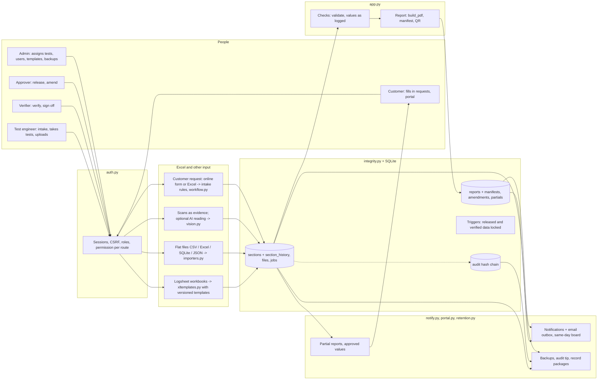

# Aletheia architecture

One Flask process and one SQLite database on a lab PC; browsers on the lab network (staff and customers) use it.

Data flow: every input becomes one row per test section (`sections`), written in a single transaction per upload, with every
revision copied to `section_history` and the uploaded file kept in `files`. The job's data dict is assembled from its
sections when read, so `validate` and `build_pdf` see one structure. Every action writes an audit entry, chained to the
previous one by hash.

## Modules

| Module | Responsibility |
|---|---|
| `app.py` | REST API, job lifecycle, checks (`validate`), report (`build_pdf`, normal and partial), workflow routes (verify, sign-off, intake), approval and amendment, search, statistics |
| `auth.py` | Users and customer organisations, password hashing, sessions (idle/absolute timeout, lock-out), CSRF, `PERMS` and the `before_request` gate that refuses any route without a rule |
| `integrity.py` | Section rows with revisions (optimistic locking), section history, files, series/sample allocation, audit hash chain, database triggers, numbered migrations with backup |
| `workflow.py` | Intake validation (required fields, formats, PIN-code table; also the customer's own online request), test plan, ownership and certification, progress, sign-off readiness |
| `xltemplates.py` | Template engine: read a sheet (names, labels, cells, tables; statuses per value), draw blank and filled sheets, diff and validate mappings |
| `seed_templates.py` | Version 1 of the logsheet templates and the customer request form (seeds the registry once) |
| `excel_routes.py` | Template registry (draft / active / retired), upload preview and import, several jobs per workbook, Excel downloads |
| `notify.py` | In-app notifications, email outbox and worker, same-day cut-off and board, settings |
| `portal.py` | Partial reports, approved values with logsheet labels, requests filled in online by customers, Excel request forms |
| `retention.py` | Backups with checksums, backup check, audit tip, record packages, server clock |
| `importers.py` | Flat-layout readers and exporters (CSV, Excel, SQLite, JSON), legacy registers |
| `vision.py` | Optional AI reading of scanned sheets (off unless `ALETHEIA_FEATURE_SCAN=1`) |
| `rules.py` | Engineering thresholds with source and status |
| `static/` | Single-page UI: `index.html` (pages, job page, report), `auth.js` (sign-in, roles, Admin and customer pages), `workflow.js` (verification card, intake, My work, amendments), `excel.js` (upload preview, templates), `portal.js` (notifications, Today, Settings, customer additions), `ui.js` (user menu, dashboard tasks, take / assign tests, customer request form, dashboard emblem) |

## Data model (`aletheia.db`, schema version 2)

| Table | Contents |
|---|---|
| `users`, `orgs` | Accounts (roles, employee ID, certified tests, lock-out, session epoch) and customer organisations. Never deleted |
| `jobs` | One job: series (unique), sample, customer, stage 0-4, findings, verdict, org, test `plan`, `intake` record, sign-off, open `amend`, `cutoff`, `same_day` |
| `sections` | One row per test of a job: state (uploaded / returned / verified / na), data, data SHA-256, revision, file, template, uploader + bay, verifier, note |
| `section_history` | Every revision and state change of every section (append-only) |
| `files` | Uploaded data files byte-for-byte with SHA-256 (append-only) |
| `imports` | Each import: file, kind, sections brought, user (lets an import be undone before release) |
| `sources` | Scans and photos kept as evidence |
| `reports` | Every generated / released PDF: version, token, SHA-256, approver, manifest and its SHA-256 (unchangeable) |
| `amendments` | Reason, tests reopened, both signers, from / to version (kept for good) |
| `partials` | Every partial report version shown to the customer, with its hash |
| `templates` | Template versions with mapping, status, sample sheet |
| `assignments`, `bays`, `counters` | Test-to-engineer assignments with the bay, test bays, series/sample counters |
| `notifications`, `outbox`, `settings`, `customer_forms` | Notices, queued emails, lab settings, customers' requests (filled online, or Excel) |
| `audit` | Every action: who, role, workstation, kind, text, previous hash, own hash |
| `schema_version` | Migrations applied |

## Who assigns tests

| Who | Can |
|---|---|
| Administrator | Assign or reassign any test of an open job, or the whole job at once, to a test engineer (certified for the test), with the bay; the engineer is notified |
| Test engineer | Take a planned test nobody is assigned to and nobody has started, choosing the bay; give it back before starting. At intake, tick the tests they will do themselves |

Uploads without a bay use the bay of the assignment. Each person's dashboard lists their tasks: engineers what to test and what is
free to take, verifiers what to verify and sign off, approvers what to approve, the administrator what waits for approval,
tests not assigned, customer requests waiting, and locked accounts.

## Job lifecycle

| Stage | Reached when |
|---|---|
| (before) Request | The customer fills in the request online (or sends the Excel form); it waits in the intake inbox |
| 0 Request captured | Intake recorded (or request created from a file) |
| 1 Data imported | Any test data uploaded or changed (also voids the sign-off) |
| 2 Validated | Checks run without data-layout errors |
| 3 Report ready | Flagged items reviewed, every planned test verified or not applicable, job signed off, report generated |
| 4 Released | Approved by an approver who did not work on the data, with a complete, checked intake |

A released job changes only through an **amendment** (back to stage 1 for the named tests only; the released version stays
valid until version n+1 is released). Historical records from registers (`archived = 1`) stay out of the pipeline.
