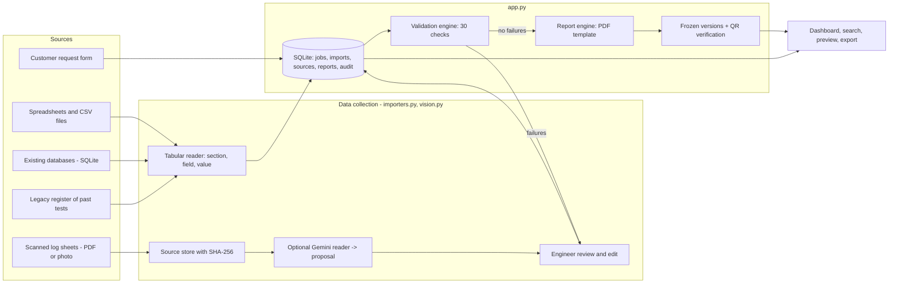

# Aletheia architecture

Data flow: every source ends up as the same per-section structure in the `jobs` table. Any change to that data resets
the job to "Data imported", so validation and the report are always derived from what is stored. Reports are built once
per version and stored with their hash; the verification page recomputes the hash on request.

| Module | Responsibility |
|---|---|
| `importers.py` | Detect file type, read CSV / Excel / SQLite / JSON, convert between table rows and nested data, read legacy registers, export templates |
| `vision.py` | Send one source document to Gemini on request, enforce the daily limit, return a proposal only |
| `app.py` | REST API, SQLite storage and audit trail, validation rules, PDF layout, report versions |
| `static/index.html` | Single-page UI: dashboard, workflow, records, preview, architecture, verification |
