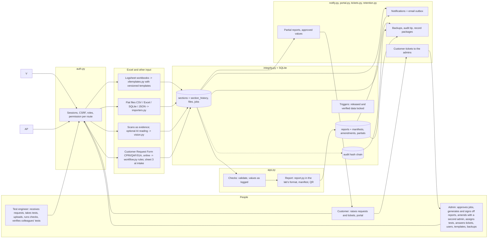

# Aletheia architecture

One Flask process and one SQLite database on a lab PC; browsers on the lab network (staff and customers) use it.

Data flow: every input becomes one row per test section (`sections`), written in a single transaction per upload, with every
revision copied to `section_history` and the uploaded file kept in `files`. A job starts only from a customer's request: its
values become the `request` section (kept as sent, never edited by the laboratory or by a data file). The job's data dict is assembled from its
sections when read, so `validate` and `build_pdf` see one structure. Every action writes an audit entry, chained to the
previous one by hash.

## Modules

| Module | Responsibility |
|---|---|
| `report.py` | The report PDF in the lab's format (sheets, sheet references, ULR footer), normal and partial |
| `app.py` | REST API, job lifecycle, checks (`validate`), report (`build_pdf`, which calls `report.py`), workflow routes (verify, sign-off, intake), approval and amendment, search, statistics |
| `auth.py` | Users and customer organisations, password hashing, sessions (idle/absolute timeout, lock-out), CSRF, `PERMS` and the `before_request` gate that refuses any route without a rule |
| `integrity.py` | Section rows with revisions (optimistic locking), section history, files, series/sample allocation, audit hash chain, database triggers, numbered migrations with backup |
| `workflow.py` | The Customer Request Form CPRI/QAF/01A: fields of sheets 1-2 (customer) and sheet 3 (laboratory) and their rules (required fields, formats, PIN-code table, choices, declarations), test plan, ownership and certification, progress, sign-off readiness |
| `xltemplates.py` | Template engine: read a sheet (names, labels, cells, tables; statuses per value), draw blank and filled sheets, diff and validate mappings |
| `seed_templates.py` | Version 1 of the logsheet templates and of an Excel request form kept in the registry (seeds it once) |
| `excel_routes.py` | Template registry (draft / active / retired), upload preview and import, several jobs per workbook, Excel downloads |
| `notify.py` | In-app notifications, email outbox and worker, settings |
| `tickets.py` | Customer tickets to the administrators: thread (append-only), status open / answered / closed, notifications |
| `portal.py` | Partial reports, approved values with logsheet labels, customers' test requests (send, check, correct, the laboratory's inbox) |
| `retention.py` | Backups with checksums, backup check, audit tip, record packages, server clock |
| `importers.py` | Flat-layout readers and exporters (CSV, Excel, SQLite, JSON), legacy registers |
| `vision.py` | Optional AI reading of scanned sheets (off unless `ALETHEIA_FEATURE_SCAN=1`) |
| `rules.py` | Engineering thresholds with source and status |
| `static/` | Single-page UI: `index.html` (pages, job page, report), `auth.js` (sign-in, roles, Admin and customer pages), `workflow.js` (verification card, intake, My work, amendments), `excel.js` (upload preview, templates), `portal.js` (notifications, Settings, customer additions), `request.js` (Customer Request Form laid out as the printed form, customer requests, intake inbox and receiving a request), `tickets.js` (tickets for customers and administrators), `ui.js` (user menu, dashboard tasks, take / assign tests, dashboard emblem) |

## Data model (`aletheia.db`, schema version 2)

| Table | Contents |
|---|---|
| `users`, `orgs` | Accounts (roles, employee ID, certified tests, lock-out, session epoch) and customer organisations. Never deleted |
| `jobs` | One job: series (unique), sample, customer, stage 0-4, findings, verdict, org, test `plan`, `intake` record, sign-off, open `amend`, `completed_at` (release time) |
| `sections` | One row per test of a job: state (uploaded / returned / verified / na), data, data SHA-256, revision, file, template, uploader + bay, verifier, note |
| `section_history` | Every revision and state change of every section (append-only) |
| `files` | Uploaded data files byte-for-byte with SHA-256 (append-only) |
| `imports` | Each import: file, kind, sections brought, user (lets an import be undone before release) |
| `sources` | Scans and photos kept as evidence |
| `reports` | Every generated / released PDF: version, token, SHA-256, approver, manifest and its SHA-256 (unchangeable) |
| `amendments` | Reason, tests reopened, both signers, from / to version (kept for good) |
| `partials` | Every partial report version shown to the customer, with its hash |
| `templates` | Template versions with mapping, status, sample sheet |
| `assignments`, `bays`, `counters` | Test-to-engineer assignments with the bay, test bays, series/sample counters |
| `notifications`, `outbox`, `settings`, `customer_forms` | Notices, queued emails, lab settings, customers' requests as sent (status received / returned with reason / used / replaced) |
| `tickets`, `ticket_messages` | Customer tickets and their messages (messages cannot be changed or removed) |
| `audit` | Every action: who, role, workstation, kind, text, previous hash, own hash |
| `schema_version` | Migrations applied |

## Who assigns tests

| Who | Can |
|---|---|
| Administrator | Assign or reassign any test of an open job, or the whole job at once, to a test engineer (certified for the test), with the bay; the engineer is notified |
| Test engineer | Take a planned test nobody is assigned to and nobody has started, choosing the bay; give it back before starting. At intake, tick the tests they will do themselves |

Uploads without a bay use the bay of the assignment. Each person's dashboard lists their tasks: engineers what to test and what is
free to take and what colleagues uploaded for them to verify; the administrator what is ready to approve and to sign off,
tests not assigned, customer requests waiting, customer tickets to answer, and locked accounts.

## Job lifecycle

| Stage | Reached when |
|---|---|
| (before) Request | The customer fills in the Customer Request Form online; it waits in the intake inbox, or is returned to them with the reason |
| 0 Request captured | The laboratory accepted the request: sheet 3 recorded, series and sample numbers assigned |
| 1 Data imported | Any test data uploaded or changed (also voids the sign-off) |
| 2 Validated | Checks run without data-layout errors |
| 3 Report ready | Flagged items reviewed, every planned test verified (by a tester other than its uploader) or not applicable, job approved by an administrator, report generated |
| 4 Released | Signed off by an administrator (the one who approved the job may sign), with a complete, checked intake |

A released job changes only through an **amendment** (back to stage 1 for the named tests only; the released version stays
valid until version n+1 is released). Historical records from registers (`archived = 1`) stay out of the pipeline.
